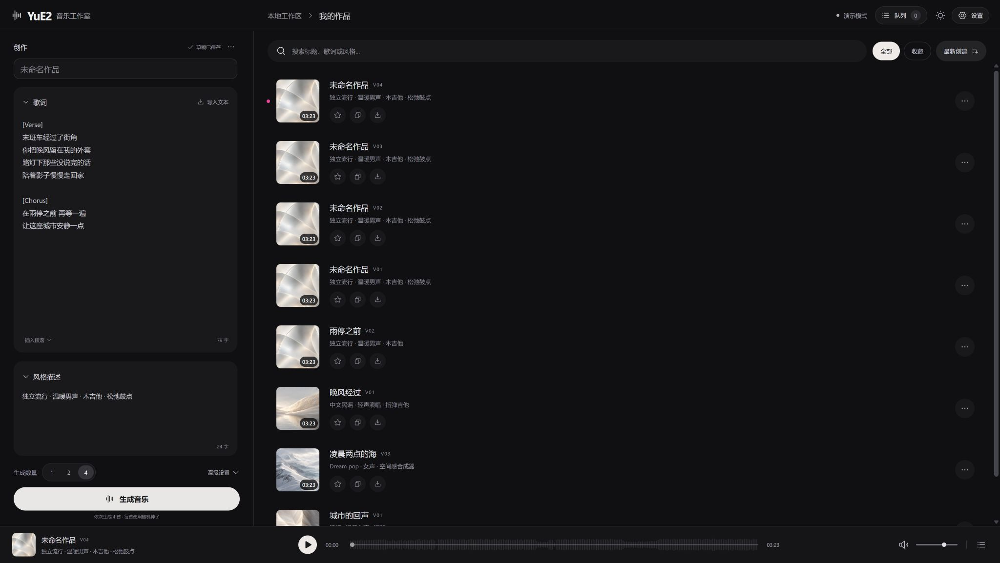
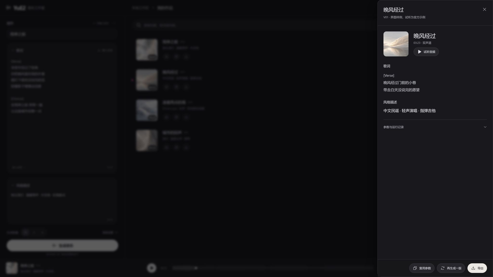
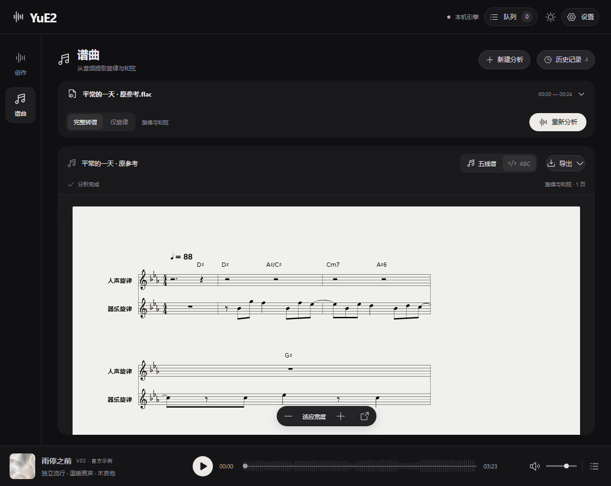
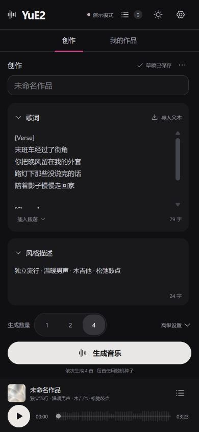

# YuE2 Workstation

[中文说明](README.md) · [Official YuE2-3B model](https://huggingface.co/m-a-p/YuE2-3B/tree/main) · [Upstream YuE2](https://github.com/multimodal-art-projection/YuE)

A Windows-focused local workstation built on YuE2. It provides lyrics/style generation, quick and advanced creation modes, editable ABC scores, reference-audio transcription, instrumental conversion, persistent jobs, export, and optional Qwen/DeepSeek assistants.

> This source repository is for developers. Model weights, virtual environments, the bundled Python runtime, browser binaries, user data, and API keys are intentionally excluded.

## Screenshots

These screenshots show the main workstation flows. The works and content shown are demo data.

| Creation workbench | Work details |
|---|---|
|  |  |

| ABC score workspace | Mobile creation |
|---|---|
|  |  |

## Requirements

- Windows 10/11 x64
- NVIDIA GPU with BF16 support; 24 GB VRAM recommended
- Python 3.12 x64, PowerShell 7, Node.js 20+, npm, and Git
- At least 25 GB of free disk space for all models and dependencies

## Development setup

```powershell
git clone https://github.com/yamanacn/YUE2-workstation.git
cd YUE2-workstation
pwsh -File runtime/setup-dev.ps1 -DownloadModels -InstallBrowser -BuildFrontend
pwsh -File .\启动YuE2-dev.ps1
```

The server opens <http://127.0.0.1:4174/>. Keep the terminal open; closing it or pressing `Ctrl+C` stops the service.

## Model placement

Core generation:

- [m-a-p/YuE2-3B](https://huggingface.co/m-a-p/YuE2-3B/tree/main) → `models/YuE2-3B/`
- [m-a-p/YuE2-Vae](https://huggingface.co/m-a-p/YuE2-Vae/tree/main) → `models/YuE2-Vae/`

Reference-audio transcription:

- [m-a-p/MERT-v2-FullSong](https://huggingface.co/m-a-p/MERT-v2-FullSong/tree/main) → `models/MERT-v2-FullSong/`
- [m-a-p/SheetSage2](https://huggingface.co/m-a-p/SheetSage2/tree/main) → `models/SheetSage2/`

Download pinned revisions:

```powershell
.\.venv\Scripts\python.exe runtime\download_all_models.py
```

Or use the Hugging Face CLI:

```powershell
hf download m-a-p/YuE2-3B --local-dir models/YuE2-3B
hf download m-a-p/YuE2-Vae --local-dir models/YuE2-Vae
hf download m-a-p/MERT-v2-FullSong --local-dir models/MERT-v2-FullSong
hf download m-a-p/SheetSage2 --local-dir models/SheetSage2
```

`model.safetensors` must be directly inside each listed directory. Do not create an extra nested model-name folder.

## AI assistants and privacy

Qwen3.8-Flash and DeepSeek-Flash are optional. Keys are stored locally in `data/assistant-config.json`, which is ignored by Git. Text is sent to the selected provider only when an AI Chat request is submitted. Local music generation does not require either API.

## Licenses

- Workstation source: Apache-2.0, see [LICENSE](LICENSE)
- Upstream YuE2 source: Apache-2.0, see [vendor/yue2/LICENSE](vendor/yue2/LICENSE)
- YuE2 weights: CC BY-NC 4.0, see [MODEL_LICENSE.md](MODEL_LICENSE.md)
- Third-party notices: [THIRD_PARTY_NOTICES.md](THIRD_PARTY_NOTICES.md)

Model weights are not included. The source license does not override the model-weight license.

This is an independent workstation built on YuE2 and is not an official upstream desktop application.
